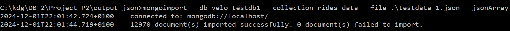

# Project VeloDB MongoDB
Hieronder de stappen die genomen zijn voor het opzetten van de databank in MongoDB.

## Subset VeloDB exporteren naar JSON
Testdata om mee te beginnen.

```SQL
COPY (
    SELECT JSON_AGG(ROW_TO_JSON(testdata))
    FROM (SELECT rideid,
                 startpoint,
                 endpoint,
                 starttime,
                 endtime,
                 (SELECT ARRAY_TO_JSON(ARRAY_AGG(ROW_TO_JSON(v)))
                  FROM (SELECT vehicleid,
                               serialnumber,
                               (SELECT ARRAY_TO_JSON(ARRAY_AGG(ROW_TO_JSON(blot)))
                                FROM (SELECT b.bikelotid,
                                             b.deliverydate,
                                             (SELECT ARRAY_TO_JSON(ARRAY_AGG(ROW_TO_JSON(btyp)))
                                              FROM (SELECT *
                                                    FROM bike_types
                                                    WHERE bike_types.biketypeid = b.biketypeid
                                                    ) AS "btyp"
                                              ) AS "bike_type"
                                      FROM bikelots AS "b"
                                      WHERE b.bikelotid = vehicles.bikelotid
                                      ) AS "blot"
                                ) AS "bike_lot"
                        FROM vehicles
                        WHERE r.vehicleid = vehicles.vehicleid
                        ) AS "v"
                  ) AS "vehicle_info" -- array met alle info over elk voertuig
          FROM rides AS "r"
          WHERE DATE(starttime) BETWEEN TO_DATE('2019-09-22', 'YYYY-MM-DD') AND TO_DATE('2019-09-24', 'YYYY-MM-DD')
          LIMIT 20000
          ) AS "testdata"
) TO 'C:\kdg\DB_2\Project_P2\output_json\testdata_1.json';
```

## Installatie en opzetten MongoDB
### Installatie MongoDB
<p>Bij het installeren van MongoDB op het systeem, werd de default instelling "Install MongoDB as a Service" volgens de opgave uitgevinkt. Dit wil zeggen dat de databank enkel lokaal op het systeem zal bestaan.</p>


<p>Hierna werden ook "MongoDB Shell" en "MongoDB Command Line Database Tools" geïnstalleerd.</p>


### Aanmaken directories voor Shards en Replica Sets
Om de databank lokaal op te slaan werd ten eerste de map ```C:\data``` aangemaakt. 
Hierin werden twee submappen gecreëerd, nl. ```db``` en ```configdb```, respectievelijk voor de werkelijke rittendata en de metadata van de databank.

### Servers starten
```commandline
mongod --configsvr --dbpath configdb\cfg0 --port 27017 --logpath configdb\cfg0\cfg0.log --replSet cfg
```
```commandline
mongod --configsvr --dbpath configdb\cfg1 --port 27018 --logpath configdb\cfg1\cfg1.log --replSet cfg
```
```commandline
mongod --configsvr --dbpath configdb\cfg2 --port 27019 --logpath configdb\cfg2\cfg2.log --replSet cfg
```
```commandline
mongod --shardsvr --replSet A --dbpath shardA0 --port 27020 --logpath shardA0\shardA0.log
```
```commandline
mongod --shardsvr --replSet A --dbpath shardA1 --port 27021 --logpath shardA1\shardA1.log
```
```commandline
mongod --shardsvr --replSet B --dbpath shardB0 --port 27022 --logpath shardB0\shardB0.log
```
```commandline
mongod --shardsvr --replSet B --dbpath shardB1 --port 27023 --logpath shardB1\shardB1.log
```
```commandline
mongod --shardsvr --replSet C --dbpath shardC0 --port 27024 --logpath shardC0\shardC0.log
```
```commandline
mongod --shardsvr --replSet C --dbpath shardC1 --port 27025 --logpath shardC1\shardC1.log
```
Ter illustratie:
(FOTO)

### Verbinding Mongos
```commandline
mongos --configdb cfg/localhost:27017,localhost:27018,localhost:27019 --bind_ip localhost --port 27100
```

### Configuratie MongoDB Shell
```commandline
mongosh --port 27100
```
[enabling sharding and such comes here]

### Opzetten databank met JSON file
EERST MULTIPLE SERVERS ZETTEN EN SHARDING ENABLEN EN DAN PAS COLLECTION OPLADEN!!!<br>
EN IK MOET DE DB NOG EENS OPZETTEN MET DE VERKLEINDE DATASET!!!<br>
De databank werd opgezet door gebruik te maken van de ```mongoimport``` command-line tool:

#### 1. MongoDB Server Starten
De adressen van de MongoDB applicatie, MongoDB Shell en MongoDB CL Database Tools werden na het installeren aan de 'Path' environment variable van het systeem toegevoegd. 
De applicatie kan dus nu worden opgestart door in het CLI de commando ```mongod``` in te voeren.


#### 2. JSON-data importeren met ```mongoimport```
Een nieuwe CLI-venster werd geopend in de locatie van de JSON file. Met de volgende commando werd een nieuwe database "velo_testdb1" met de collection "rides_data" aangemaakt met daarin de data van de JSON file:
```commandline
mongoimport --db velo_testdb1 --collection rides_data --file .\testdata_1.json --jsonArray
```
Bevestiging CLI:

#### 3. MongoDB Shell
Met de commando ```mongosh``` werd de MongoDB Shell opgestart en de verbinding werd automatisch vastgelegd.


<p>Ter bevestiging kan men via deze Shell zien dat de relevante data inderdaad werd ingeladen:</p>


