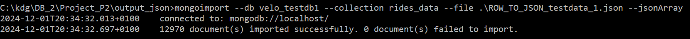
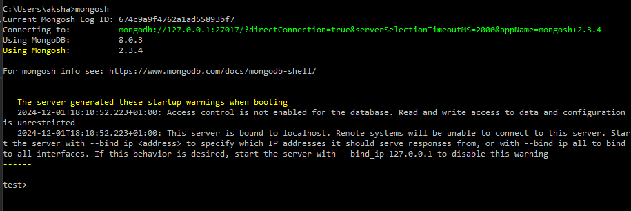
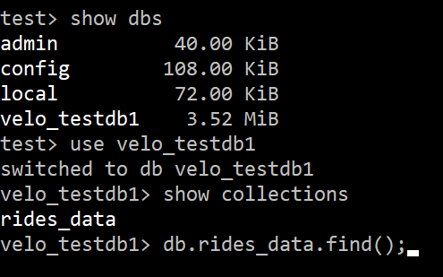

# Project VeloDB MongoDB
Hieronder de stappen die genomen zijn voor het opzetten van de databank in MongoDB.

## Subset VeloDB exporteren naar JSON
Testdata om mee te beginnen.

```SQL
SELECT ROW_TO_JSON(testdata) AS "ride"
FROM (SELECT rideid, startpoint, endpoint, starttime, endtime,
             (SELECT ARRAY_TO_JSON(ARRAY_AGG(ROW_TO_JSON(v)))
              FROM (SELECT vehicleid, serialnumber,
                           (SELECT ARRAY_TO_JSON(ARRAY_AGG(ROW_TO_JSON(blot)))
                            FROM (SELECT b.bikelotid, b.deliverydate,
                                         (SELECT ARRAY_TO_JSON(ARRAY_AGG(ROW_TO_JSON(btyp)))
                                          FROM (SELECT *
                                                FROM bike_types
                                                WHERE bike_types.biketypeid = b.biketypeid
                                                ) AS "btyp"
                                          ) AS "bike_type"
                                  FROM bikelots AS "b"
                                  WHERE b.bikelotid = vehicles.bikelotid
                                  ) AS "blot"
                            ) AS "bike_lot",
                           lastmaintenanceon, lockid, position
                    FROM vehicles
                    WHERE r.vehicleid = vehicles.vehicleid
                    ) AS "v"
              ) AS "vehicle_info", -- array met alle info over het voertuig per rit
             (SELECT ARRAY_TO_JSON(ARRAY_AGG(ROW_TO_JSON(sub)))
              FROM (SELECT subscriptionid, validfrom,
                           (SELECT ARRAY_TO_JSON(ARRAY_AGG(ROW_TO_JSON(subtyp)))
                            FROM (SELECT *
                                  FROM subscription_types AS "st"
                                  WHERE st.subscriptiontypeid = s.subscriptiontypeid
                                  ) AS "subtyp"
                            ) AS "sub_type",
                           (SELECT ARRAY_TO_JSON(ARRAY_AGG(ROW_TO_JSON(u)))
                            FROM (SELECT *
                                  FROM velo_users AS "u"
                                  WHERE u.userid = s.userid
                                  ) AS "u"
                            ) AS "velo_user"
                    FROM subscriptions AS "s"
                    WHERE s.subscriptionid = r.subscriptionid
                    ) AS "sub"
              ) AS "sub_info",
          startlockid, endlockid
      FROM rides AS "r"
      WHERE DATE(starttime) BETWEEN TO_DATE('2019-09-22', 'YYYY-MM-DD') AND TO_DATE('2019-09-24', 'YYYY-MM-DD')
      LIMIT 20000
      ) AS "testdata";
```
## Installatie en opzetten MongoDB
### Installatie MongoDB
<p>Bij het installeren van MongoDB op het systeem, werd de default instelling "Install MongoDB as a Service" volgens de opgave uitgevinkt. Dit wil zeggen dat de databank enkel lokaal op het systeem zal bestaan.</p>


<p>Hierna werden ook "MongoDB Shell" en "MongoDB Command Line Database Tools" geïnstalleerd.</p>

### Opzetten databank met JSON file
De databank werd opgezet door gebruik te maken van de ```mongoimport``` command-line tool:

#### 1. MongoDB Server Starten
De adressen van de MongoDB applicatie, MongoDB Shell en MongoDB CL Database Tools werden na het installeren aan de 'Path' environment variable van het systeem toegevoegd. 
De applicatie kan dus nu worden opgestart door in het CLI de commando ```mongod``` in te voeren.


#### 2. JSON-data importeren met ```mongoimport```
Een nieuwe CLI-venster werd geopend in de locatie van de JSON file. Met de volgende commando werd een nieuwe database "velo_testdb1" met de collection "rides_data" aangemaakt met daarin de data van de JSON file:
```commandline
mongoimport --db velo_testdb1 --collection rides_data --file .\ROW_TO_JSON_testdata_1.json --jsonArray
```
Bevestiging CLI:


#### 3. MongoDB Shell
Met de commando ```mongosh``` werd de MongoDB Shell opgestart en de verbinding werd automatisch vastgelegd.



<p>Ter bevestiging kan men via deze Shell zien dat de relevante data inderdaad werd ingeladen:</p>




