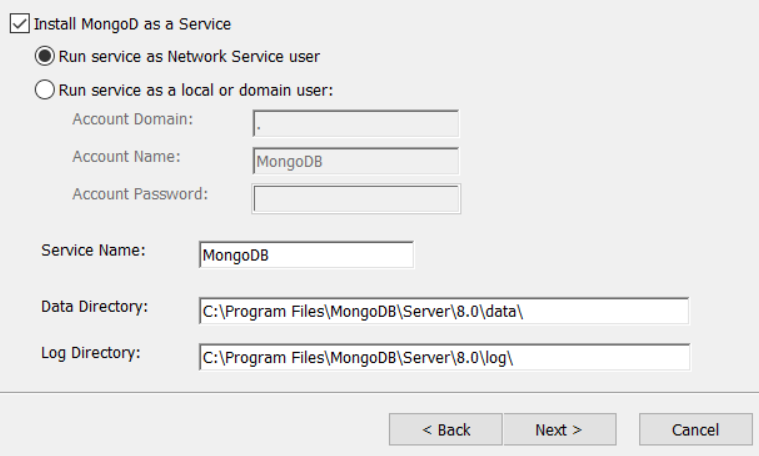

# Project VeloDB MongoDB
Hieronder de stappen die genomen zijn voor het opzetten van de databank in MongoDB.

## Subset VeloDB exporteren naar JSON
Testdata om mee te beginnen.

```SQL
SELECT ROW_TO_JSON(testdata) AS "ride"
FROM (SELECT rideid, startpoint, endpoint, starttime, endtime,
             (SELECT ARRAY_TO_JSON(ARRAY_AGG(ROW_TO_JSON(v)))
              FROM (SELECT vehicleid, serialnumber,
                           (SELECT ARRAY_TO_JSON(ARRAY_AGG(ROW_TO_JSON(blot)))
                            FROM (SELECT b.bikelotid, b.deliverydate,
                                         (SELECT ARRAY_TO_JSON(ARRAY_AGG(ROW_TO_JSON(btyp)))
                                          FROM (SELECT *
                                                FROM bike_types
                                                WHERE bike_types.biketypeid = b.biketypeid
                                                ) AS "btyp"
                                          ) AS "bike_type"
                                  FROM bikelots AS "b"
                                  WHERE b.bikelotid = vehicles.bikelotid
                                  ) AS "blot"
                            ) AS "bike_lot",
                           lastmaintenanceon, lockid, position
                    FROM vehicles
                    WHERE r.vehicleid = vehicles.vehicleid
                    ) AS "v"
              ) AS "vehicle_info", -- array met alle info over het voertuig per rit
             (SELECT ARRAY_TO_JSON(ARRAY_AGG(ROW_TO_JSON(sub)))
              FROM (SELECT subscriptionid, validfrom,
                           (SELECT ARRAY_TO_JSON(ARRAY_AGG(ROW_TO_JSON(subtyp)))
                            FROM (SELECT *
                                  FROM subscription_types AS "st"
                                  WHERE st.subscriptiontypeid = s.subscriptiontypeid
                                  ) AS "subtyp"
                            ) AS "sub_type",
                           (SELECT ARRAY_TO_JSON(ARRAY_AGG(ROW_TO_JSON(u)))
                            FROM (SELECT *
                                  FROM velo_users AS "u"
                                  WHERE u.userid = s.userid
                                  ) AS "u"
                            ) AS "velo_user"
                    FROM subscriptions AS "s"
                    WHERE s.subscriptionid = r.subscriptionid
                    ) AS "sub"
              ) AS "sub_info",
          startlockid, endlockid
      FROM rides AS "r"
      WHERE DATE(starttime) BETWEEN TO_DATE('2019-09-22', 'YYYY-MM-DD') AND TO_DATE('2019-09-24', 'YYYY-MM-DD')
      LIMIT 20000
      ) AS "testdata";
```
## Installatie en opzetten MongoDB
### Installatie MongoDB
Bij het installeren van MongoDB op het systeem, werd de default instelling "Install MongoDB as a Service" volgens de opgave uitgevinkt. Dit wil zeggen dat men de databank enkel via het CLI zal kunnen aanspreken.


### Opzetten databank met JSON file

