# Project VeloDB MongoDB
Hieronder de stappen die genomen zijn voor het opzetten van de databank in MongoDB.

## Subset VeloDB exporteren naar JSON
Wegens beperkingen van PyCharm kon de gewenste data niet als één JSON file geëxporteerd worden. Bijgevolg werd het in 3 files verdeeld; dit omdat, a.d.h.v. testen, 3 files het minimum aantal nodig bleek te zijn. 
De queries gebruikt zowel voor die test (op basis van datum) als om de werkelijke data te exporteren zijn terug te vinden in 'Data_export.sql' in de map 'SQL'. Om alles klaar te zetten en de werking van de databank te testen werd enkel het eerste deel gebruikt, en de andere twee werden daarna opgeladen.  
\
Deel 1 om mee te beginnen:

```SQL
COPY (
    SELECT JSON_AGG(ROW_TO_JSON(data_part_1))
    FROM (SELECT rideid,
                 startpoint,
                 endpoint,
                 starttime,
                 endtime,
                 (SELECT ARRAY_TO_JSON(ARRAY_AGG(ROW_TO_JSON(v)))
                  FROM (SELECT vehicleid,
                               serialnumber,
                               (SELECT ARRAY_TO_JSON(ARRAY_AGG(ROW_TO_JSON(blot)))
                                FROM (SELECT b.bikelotid,
                                             b.deliverydate,
                                             (SELECT ARRAY_TO_JSON(ARRAY_AGG(ROW_TO_JSON(btyp)))
                                              FROM (SELECT *
                                                    FROM bike_types
                                                    WHERE bike_types.biketypeid = b.biketypeid
                                                    ) AS "btyp"
                                              ) AS "bike_type"
                                      FROM bikelots AS "b"
                                      WHERE b.bikelotid = vehicles.bikelotid
                                      ) AS "blot"
                                ) AS "bike_lot"
                        FROM vehicles
                        WHERE r.vehicleid = vehicles.vehicleid
                        ) AS "v"
                  ) AS "vehicle_info" -- array met alle info over elk voertuig
          FROM rides AS "r"
           WHERE DATE(starttime) BETWEEN TO_DATE('2015-09-22', 'YYYY-MM-DD') AND TO_DATE('2019-09-22', 'YYYY-MM-DD')
          ) AS "data_part_1"
) TO 'C:\kdg\DB_2\Project_P2\output_json\data_part_1.json';
```

## Installatie en opzetten MongoDB
### Installatie MongoDB
<p>Bij het installeren van MongoDB op het systeem, werd de default instelling "Install MongoDB as a Service" volgens de opgave uitgevinkt. Dit wil zeggen dat de databank enkel lokaal op het systeem zal bestaan.</p>


<p>Hierna werden ook "MongoDB Shell" en "MongoDB Command Line Database Tools" geïnstalleerd.
De adressen van de MongoDB applicatie, MongoDB Shell en MongoDB CL Database Tools werden na het installeren aan de 'Path' environment variable van het systeem toegevoegd</p>


### Aanmaken directories voor Shards en Replica Sets
Om de databank lokaal op te slaan werd ten eerste de map ```C:\data``` aangemaakt. 
Hierin werden twee submappen gecreëerd, nl. ```db``` en ```configdb```, respectievelijk voor de werkelijke rittendata en de metadata van de databank.
In ```db``` werden de mappen ```A0```, ```A1```, ```B0```, ```B1```, ```C0```, ```C1``` aangemaakt, waarbij ```A0``` en ```A1``` de mappen voor de twee replicas van ```shard A``` enzovoort.
Zo werden in de map ```configdb``` ook nog submappen ```cfg0```, ```cfg1``` en ```cfg2``` aangemaakt.

### Servers opstarten en replica sets instellen
#### Config servers
Vanuit ```C:\data``` werden de volgende commando's uitgevoerd (elk in een nieuw venster) om de config servers op te zetten. 
De server op port ```26000``` werd als de primary server gekozen.
```commandline
mongod --configsvr --dbpath configdb\cfg0 --port 26000 --logpath configdb\cfg0\cfg0.log --replSet cfg
```
```commandline
mongod --configsvr --dbpath configdb\cfg1 --port 26001 --logpath configdb\cfg1\cfg1.log --replSet cfg
```
```commandline
mongod --configsvr --dbpath configdb\cfg2 --port 26002 --logpath configdb\cfg2\cfg2.log --replSet cfg
```
Op een nieuwe Command Prompt venster werd de MongoDB Shell geopend op port ```26000``` (de eerste config server):
```commandline
mongosh --port 26000
```

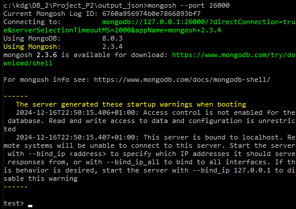

Vervolgens werd in de mongo shell de volgende configuratie ingegeven, met als ID ```cfg```, de naam van de replica set gebruikt bij het starten van de config servers: 

```javascript
rsconf = {
    _id: "cfg",
    members: [
        {
            _id: 0,
            host: "localhost:26000"
        },
        {
            _id: 1,
            host: "localhost:26001"
        },
        {
            _id: 2,
            host: "localhost:26002"
        }
    ]
};
```
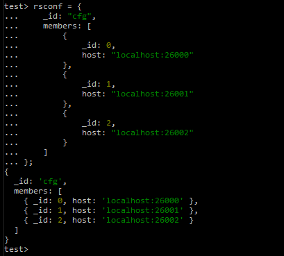

De shell geeft het ingegeven object terug als response. 
Deze configuratie werd met de volgende commando geïnitialiseerd.
```javascript
rs.initiate(rsconf);
```

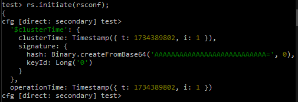

Om na te kijken of de configuratie correct is geïmplementeerd werd de volgende commando uitgevoerd. 
De shell geeft de hele confguratie van de replica set terug als output. 

```javascript
rs.status();
```
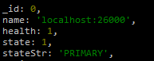

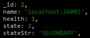

Volgens deze configuratie werd de eerste config server als de primary server ingesteld, en de andere twee als secondary die de eerste als hun bron hebben.


#### Shard servers
<p>De shard servers werden op net dezelfde manier ingesteld als de config servers. 
Enkel de shell commando's voor de eerste shard zullen hier getoond worden,
aangezien hetzelfde proces nog drie keer herhaald wordt.</p> 

Eerst werden de twee servers van de replica set ```shard_A_repl``` 
van ```shard A``` opgestart met de volgende commandline commando's, 
uitgevoerd vanuit ```C:\data```.
```commandline
mongod --shardsvr --replSet shard_A_repl --dbpath db\shardA0 --port 27020 --logpath db\shardA0\shardA0.log
```
```commandline  
mongod --shardsvr --replSet shard_A_repl --dbpath db\shardA1 --port 27021 --logpath db\shardA1\shardA1.log
```
Dan werd mongo shell op het adres van de eerste server geopend. 
Via deze shell werd de replica set ingesteld.

```commandline
mongosh --port 27020
```
In mongo shell werd het volgende uitgevoerd:
```javascript
rsconf = {
    _id: "shard_A_repl",
    members: [
        {
            _id: 0,
            host: "localhost:27020"
        },
        {
            _id: 1,
            host: "localhost:27021"
        }
    ]
};
```
```javascript
rs.initiate(rsconf);
```
```javascript
rs.status();
```
<p> Met die laatste commando werd nagekeken naar het succesvol opzetten van de replica set.</p>

Dit proces werd herhaald voor de replica sets ```shard_B_repl ``` en ```shard_C_repl ```.


```commandline
mongod --shardsvr --replSet shard_B_repl --dbpath db\shardB0 --port 27022 --logpath db\shardB0\shardB0.log
```
```commandline
mongod --shardsvr --replSet shard_B_repl --dbpath db\shardB1 --port 27023 --logpath db\shardB1\shardB1.log
```
```commandline
mongod --shardsvr --replSet shard_C_repl --dbpath db\shardC0 --port 27024 --logpath db\shardC0\shardC0.log
```
```commandline
mongod --shardsvr --replSet shard_C_repl --dbpath db\shardC1 --port 27025 --logpath db\shardC1\shardC1.log
```

### Verbinding MongoS-Cluster
De volgende commando start een ```MongoS``` instantie op en verbindt het met de vooraf gemaakte ```cfg``` replica set. 
Merk op dat er in de commando geen port gespecifiëerd wordt, waardor de MongoS instantie op de default port ```localhost:27017``` wordt opgestart.
```commandline
mongos --configdb cfg/localhost:26000,localhost:26001,localhost:26002 --bind_ip localhost
```

### Configuratie Shards
MongoS via MongoDB Shell. De port hoeft hier niet vermeld te worden aangezien het de default port is.
```commandline
mongosh --port 27017
``` 
\
Elk replica set wordt als een shard hieraan toegevoegd.
```javascript
sh.addShard("shard_A_repl/localhost:27020,localhost:27021");
```
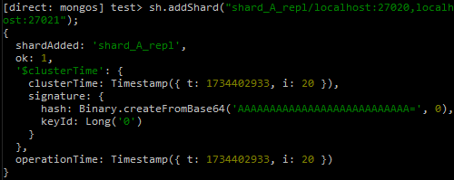
```javascript
sh.addShard("shard_B_repl/localhost:27022,localhost:27023");
```
```javascript
sh.addShard("shard_C_repl/localhost:27024,localhost:27025");
```

### Opzetten databank met JSON file
De databank werd opgezet door gebruik te maken van de ```mongoimport``` command-line tool:

#### 1. JSON-data importeren met ```mongoimport```
Een nieuwe CLI-venster werd geopend in de locatie van de JSON file. 
Met de volgende commando werd een nieuwe database "velo_db" met de collection "rides" aangemaakt met daarin de data van de JSON file:
```commandline
mongoimport --db velo_db --collection rides --file .\data_part_1.json --jsonArray
```
Bevestiging CLI:\
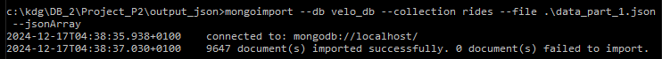

#### 2. MongoDB Shell
Met de commando ```mongosh``` werd de MongoDB Shell opgestart en de verbinding werd automatisch vastgelegd.
Aangezien er met de MongoS query router op port ```27017``` verbonden wordt 
hoeft er geen port expliciet vermeld te worden.

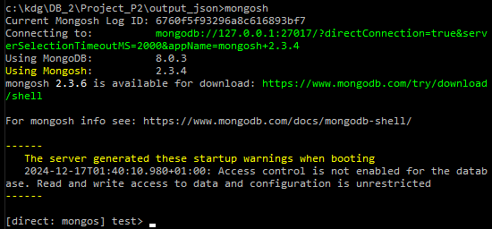

Ter bevestiging kan men via deze Shell zien dat de relevante data inderdaad werd ingeladen:

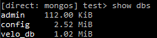

Hierna werd sharding voor de ingeladen database aangezet met:

```javascript
sh.enableSharding("velo_db");
```

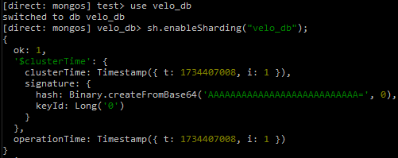

Bij het proberen sharden van de collection is er een error opgetreden. Er werd geëist dat er eerst een index voor de shard key gemaakt werd voordat de collection geshard wordt.

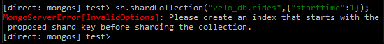

Om de index aan te maken was het nodig om eerst het attribuut ```starttime``` van ```string``` naar ```date``` om te zetten. Dit gebeurde via de volgende commando:
```javascript
db.rides.updateMany( { starttime: { $type: "string" } }, [ { $set: { starttime: { $toDate: "$starttime" } } }] );
```
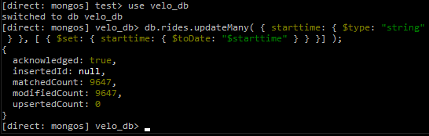

Aanmaken index met:
```javascript
db.rides.createIndex({ starttime: 1 });
```
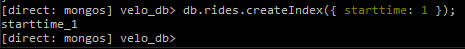

Controle op de indexes:
```javascript
db.rides.getIndexes();
```


Na het aanmaken van de index was het mogelijk om de collection te sharden.
```javascript
sh.shardCollection("veloDB.rides", { "starttime": 1 });
```
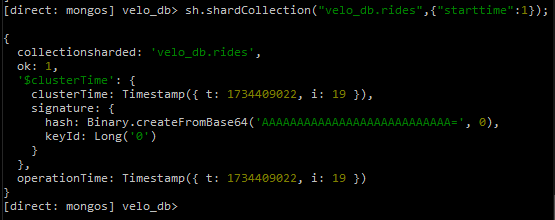

Om te verzekeren dat de data goed verdeeld wordt 
werd de staat van de balancer eerst gecheckt, 
en desnoods werd de balancer dan ook gestart.
```javascript
sh.getBalancerState();
```
```javascript
sh.startBalancer();
```

Met de commando ```sh.status();``` kan men de verdeling van de data over de servers zien. 
De testdata was te weinig om verdeeld te worden, en het werd dus enkel als 1 chunk in ```shard B``` opgeslagen.

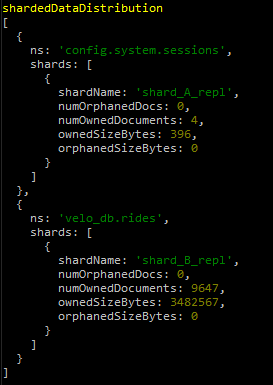 

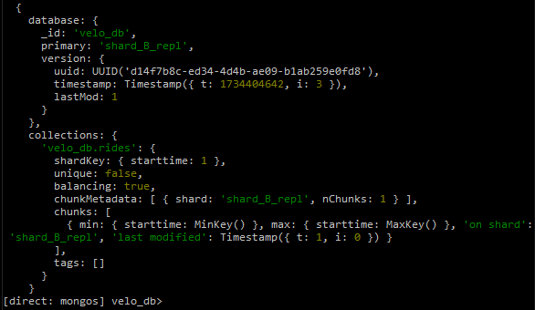

Deel resterende 2 delen van de brondata werden nu toegevoegd via commandline:
```commandline
mongoimport --db velo_db --collection rides --file .\data_part_2.json --jsonArray
```
```commandline
mongoimport --db velo_db --collection rides --file .\data_part_3.json --jsonArray
```
Dataverdeling na het inladen van volledige data:

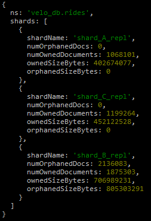

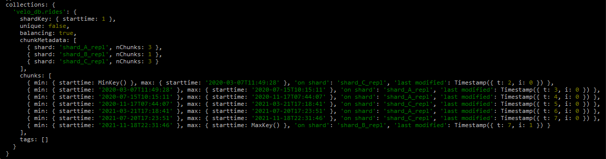

#### Test MongoDB query api
##### 1. Eerste 10 ritten tussen de gegeven data
```javascript
db.rides.find({ starttime: { $gte: ISODate("2015-09-22T00:00:00Z"), $lt: ISODate("2019-01-23T00:00:00Z") } }).limit(10);
```

##### 2. Ritten van een bepaalde type
```javascript
db.rides.find({ "vehicle_info.bike_lot.bike_type.biketypedescription": "Velo E-Bike" });
```

##### 3. Eerste 5 ritten die langer dan een uur duurden
```javascript
db.rides.find({
    $expr: {
        $gt: [
            { $subtract: [{ $toDate: "$endtime" }, { $toDate: "$starttime" }] }, // ritduur berekenen
            3600000 // 1 uur in ms
        ]
    }
});
```

##### 4. Overzicht van het aantal ritten per startpoint (station) 
```javascript
db.rides.aggregate([
    { $group: { _id: "$startpoint", count: { $sum: 1 } } },
    { $sort: { count: -1 } }
]);
```